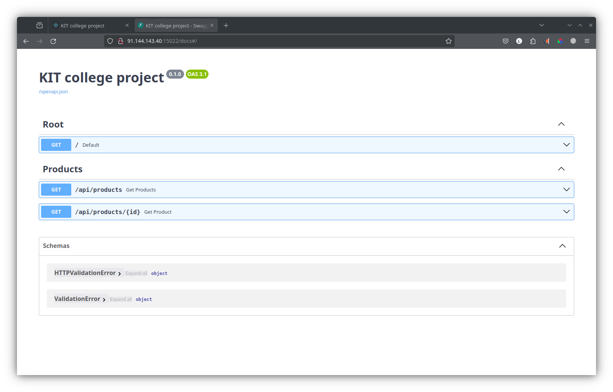

# KIT college project

## 1. Prerequisites

- VSCode
- Python v3.8 or above
- NodeJs (the latest long term support version)
- Docker Engine (Linux) / Docker Desktop (Windows or MacOs) for running inside docker containers

Attention! If you suppose to use dockers for running this project you may need to use mirrors to access the docker hub repositories.

We use Timeweb Cloud mirror <https://dockerhub.timeweb.cloud> to have an access from our country.

## 2. Installation guide (Linux)

### 2.1 Web API

#### 2.1.1. Install Python v3.xx

```bash
sudo apt update
sudo apt install python3
sudo apt install python3-pip
sudo apt install python3-venv
```

#### 2.1.2. Select the web api project folder, create and activate a virtual environment

```bash
cd web-api
python3 -m venv .venv
source ./.venv/bin/activate
```

#### 2.1.3. Install the required python packages (fastapi, sqlalchemy, ect.)

```bash
python3 -m pip install -r requirements.txt
```

### 2.1.4. Make sure that the docker engine on your machine is available and running

```bash
service docker status
```

### 2.1.5. Start the postgres database server in a docker container as the selected service in the docker compose bundle

```bash
docker compose  -f "docker-compose.yaml" up -d --build database-server
```

make sure that the database server is running!

#### 2.1.5. Try to launch the web api project in a debug mode using VSCode and make sure that the web api software equipment (swagger or redoc) will be available in the browser

```console
http://localhost:8000
http://localhost:8000/docs
http://localhost:8000/redoc
```



### 2.2. Web UI

#### 2.2.1. Install NodeJs and npm

```bash
wget -qO- https://raw.githubusercontent.com/nvm-sh/nvm/v0.39.7/install.sh | bash
exit
nvm install lts
npm use lts
node -v
npm -v
```

#### 2.2.2. Select the web ui project folder and install dependencies

```bash
cd ./web-ui
npm install
```

### 2.2.3. Make sure that the database server is running in the docker container

```bash
docker compose  -f "docker-compose.yaml" up -d --build database-server
```

### 2.2.4. Run web api in the docker container or in the debug mode using VSCode

```bash
docker compose  -f "docker-compose.yaml" up -d --build database-server web-api
```

#### 2.1.5. Try to launch the web ui project

```bash
npm run start
```

and open a start page of an application in the browser

```console
http://localhost:3000
```
